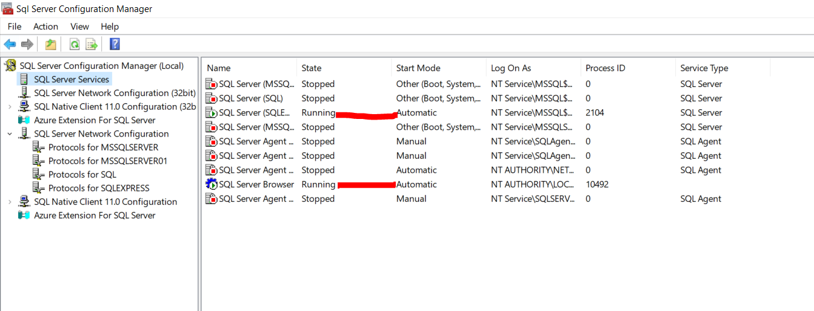
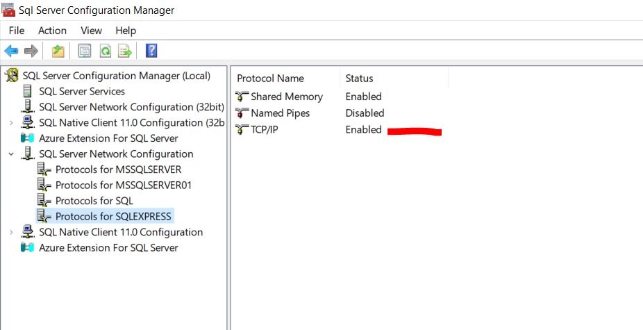
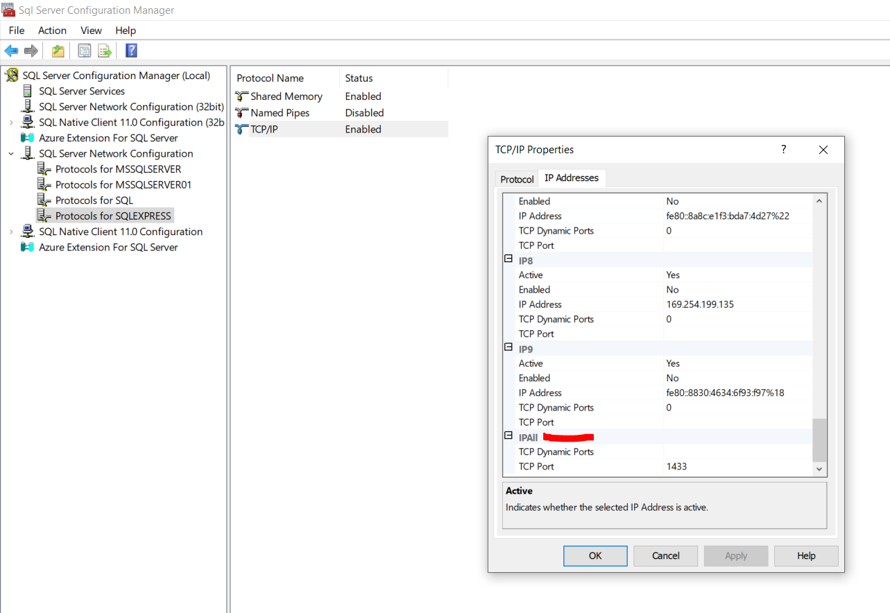

#### 1
>Config lại `DB_HOST` theo server name của SQL Server đang dùng, `DB_PASS` mật khẩu tài khoản `sa` __trong file `.env`__

``` bash
DB_HOST=DESKTOP-G15R77V
DB_PASS=56tfg7hj8
```
#### 2
Chạy script sql, có phần create table và insert. Chạy lần lượt create table -> insert cho từng database

#### 3
Config lại SQL Server để connect
> 1. Mở SQL Server Configuration Manager trên máy
> 2. Ở tab SQL Server Services  --> `SQL Server (SQLEXPRESS)` và `SQL Server Browser` có state là `running`, nếu đang stop thì cần bật lên



> 3. Ở tab SQL Server Network Configuration -> Protocols for SQLEXPRESS -> TCP/IP cần `enable`



> Double click TCP/IP -> IP Address -> IPAll (ở dưới cùng) -> set `TCP Port = 1433`, `TCP Dynamic Ports` xóa để trống 



Trên SSMS
> Right click `server name` -> properties -> Security -> Phần Server Authentication chọn SQL Server and Windows Authentication mode


#### 4
Run api trong directory `/api/src`
``` javascript
node app.js
```

Test api
```
curl -X GET http://172.28.32.1:9717/systemNhanSu/nhanvien
curl -X GET http://172.28.32.1:9717/systemNhanSu/phongban
```